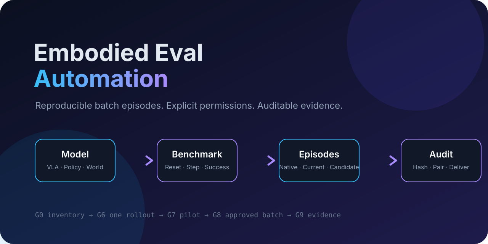
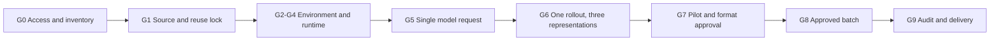

<p align="center">
  
</p>

<p align="center">
  <strong>From “the model ran” to auditable, reproducible episode data.</strong>
</p>

<p align="center">
  
  
  
</p>

[简体中文](README.zh-CN.md)

## What this is

Embodied Eval Automation is an Agent Skill–style workflow and a skills-only Codex plugin for collecting batch episodes from a policy, VLA, world model, or hybrid model against a robot benchmark or simulator.

It does not ship model weights or benchmark code. It teaches an agent how to:

- confirm the local and remote workspaces before writing;
- obtain narrowly scoped access without collecting secrets in chat;
- inventory and reuse existing repositories, environments, checkpoints, and datasets;
- pin official sources and explain the model/benchmark before execution;
- validate one request, one closed-loop episode, a pilot, and only then an approved batch;
- preserve native model output while deriving comparable episode representations;
- monitor long jobs, resume safely, verify transfers, and prune only approved data;
- deliver manifests, validators, reports, visualizations, and a reproducibility package.

## Why it exists

Batch embodied-AI runs often fail after consuming substantial GPU time because a checkpoint was not pinned, an existing benchmark environment was modified, native predictions were discarded, a transfer was assumed complete, or “success” meant only that a process stayed alive.

This project turns that work into a gated state machine with explicit evidence at every boundary.



## Quick start

Invoke the skill with a request like:

> Use `$embodied-eval-automation` to collect episodes from `<model>` on `<benchmark>`. I have a GPU server but have not decided how to authenticate. First confirm the work directories, permissions, official revisions, reusable assets, target episode set, storage thresholds, and completion criteria. Do not download, install, upload, delete, or start paid compute until I approve those actions.

The skill begins with a short intake. It will not ask you to paste passwords, tokens, private keys, or cloud credentials into the conversation.

## Installation

### Codex or another Agent Skills–compatible agent

Install or copy the directory:

```text
skills/embodied-eval-automation/
```

into the agent’s skill directory. For a GitHub install, point the installer at that subdirectory rather than the repository root.

### Skills-only Codex plugin

The repository root includes `.codex-plugin/plugin.json`. Clone the repository into your local plugin source, add it to a local marketplace with Codex’s `plugin-creator`, then start a new conversation with the plugin enabled. The same package is structured for eventual submission to the public plugin directory.

See [Publishing and release checklist](docs/publishing-checklist.md) before publishing.

## What the skill asks for

The intake is intentionally permission-aware:

1. Model, benchmark, online/offline rollout mode, and target episode set.
2. Local workspace and remote data-root choices.
3. Connection method: existing shell, SSH, provider CLI, or managed connector.
4. Read-only inspection boundary.
5. Separate approval for installs, downloads, uploads, paid compute, deletion, and Git writes.
6. Disk/GPU budgets, pause thresholds, transfer destination, and retention policy.
7. GitHub and Hugging Face access only when needed, using interactive login or existing credential stores.

## Outputs

A successful run is expected to produce:

- host and asset inventory;
- pinned source and artifact manifests;
- reuse compatibility matrix;
- model and benchmark technical report;
- run contract and expected episode ID set;
- model, benchmark, and episode adapters;
- native/current/candidate episode representations from the same rollout;
- pilot, schema, pairing, transfer, and final audit reports;
- static visualizations and a reproducibility package.

The default comparison contract keeps:

- `pair_key` independent of model identity;
- `T+1` observations for `T` executed transitions;
- every real model call in `policy_queries`;
- raw action chunks separate from executed actions;
- model predictions separate from environment observations;
- capability and quality flags instead of fabricated values.

## Security model

- Secrets stay in the user’s terminal, credential manager, SSH agent, or provider credential store.
- Host identity is verified before unattended SSH.
- Gated-model license acceptance remains a user action.
- Install, upload, deletion, paid compute, Git writes, and external messaging are distinct approvals.
- Remote data is pruned only after download, hash verification, archive inspection, audit, path-boundary checks, and explicit authorization.

Read [SECURITY.md](SECURITY.md) and [PRIVACY.md](PRIVACY.md) before using the skill on institutional or confidential infrastructure.

## Repository layout

```text
.
├── .codex-plugin/plugin.json
├── skills/embodied-eval-automation/
│   ├── SKILL.md
│   ├── agents/openai.yaml
│   ├── references/
│   ├── scripts/
│   └── assets/templates/
├── examples/
├── tests/
├── docs/
└── .github/
```

## Validation

The repository has no third-party runtime dependencies.

```bash
python skills/embodied-eval-automation/scripts/validate_repository.py .
python -m unittest discover -s tests -v
```

## Scope and limitations

- This is a workflow skill, not a universal benchmark adapter implementation.
- Each new model + benchmark pair still requires evidence-backed adapters.
- It does not bypass gated licenses, institutional policy, cloud billing controls, or benchmark terms.
- It never treats a full benchmark run as mandatory; the approved scope is the completion boundary.

## Contributing

Contributions for new providers, benchmarks, model families, schema validators, and failure playbooks are welcome. Start with [CONTRIBUTING.md](CONTRIBUTING.md).

## License

MIT. See [LICENSE](LICENSE).
